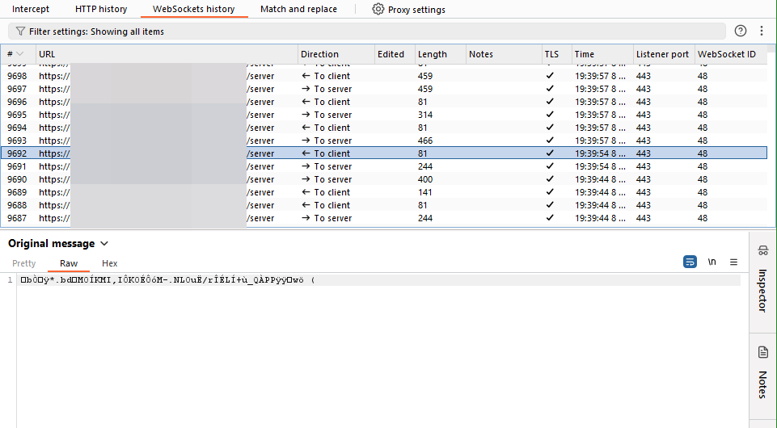
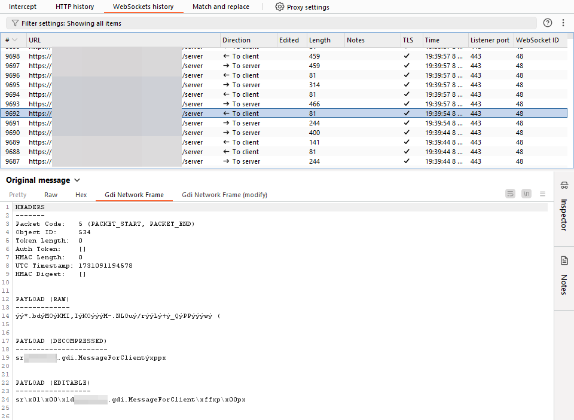
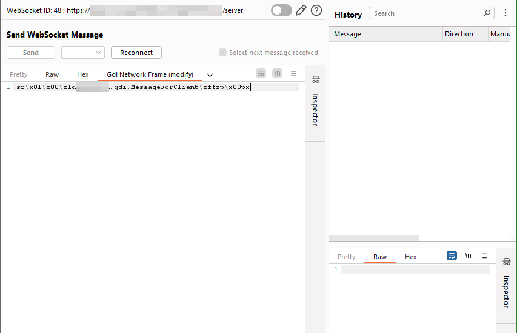

# Gdi Websocket Parser
## Background
While conducting a pentest on an application, we struggled to make sense of the traffic that was sent between the client and the server. The entire communication was implemented over websockets, but with a custom protocol. Burp is a great tool, but it was still tedious to inspect and even more tedious to modify the traffic. 

This turned out to be a great opportunity to write my first Burp extension, since I've never done this before. The goal was to simplify the process of inspecting and manipulating the messages.

## Build
1. Clone the repository.
2. Run `./gradlew jar` for Linux or `gradlew.bat jar` for Windows.
3. Add file `releases/GdiWebsocketParser-0.1.jar` as Extension in Burp.

Alternatively, import in IntelliJ IDEA and run the `jar` task.

## Usage
**Original packet without extension**: The packet is compressed, so there is not much to see.

**Parsed packet in Proxy view**: The header fields are listed, and the payload is decompressed and printed out. Bytes that represent ASCII characters (value 32 - 127) are printed out, others are shown as hexadecimal values `\xff`.
This shows that the message actually contains a serialised Java object. Interesting...

**Editor in Repeater view**: This format where non-printable characters are shown as hexadecimal values makes it easier to edit the payload. The extension converts it back into a packet. One could now change the values or insert another Java object...
